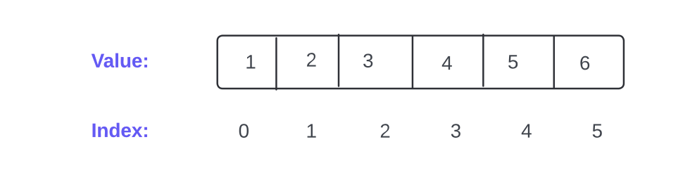
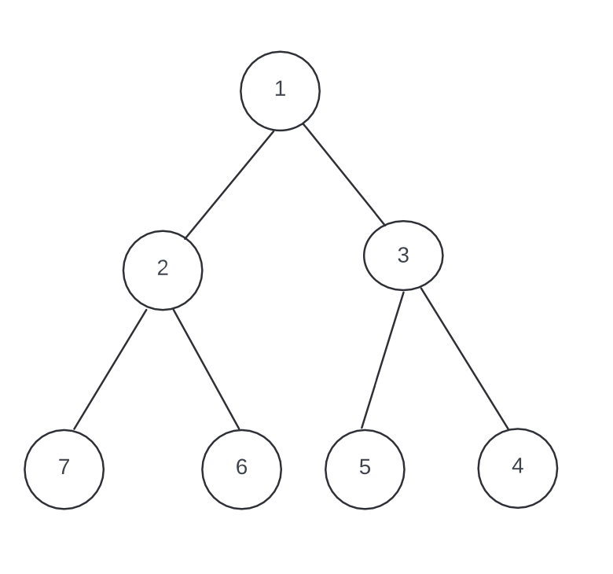

# Introduction to Data Structures

Data Structures are a way of organizing and storing data so that it can be accessed and modified efficiently. They are crucial for designing efficient algorithms and solving complex problems.

# Why Data Structures?

1. Efficiency: They help optimize performance for different operations (e.g., searching, sorting, inserting).
2. Organization: They provide ways to structure data in a meaningful way.
3. Abstraction: They allow developers to work with data in a more abstract way, focusing on what operations can be performed rather than how they are implemented.

# Types of Data Structures

## Linear Data Structures

In linear data structures, elements are arranged sequentially, and each element is connected to its previous and next element. They allow traversal in a single level of hierarchy.

Examples Arrays, Linked List, Stacks, Queues

## Non-Linear Data Structures

In non-linear data structures, elements are not arranged sequentially. They are organized in a hierarchical manner or in a graph structure, allowing more complex relationships between elements.

Example Trees, Graph

## Examples and Comparison

### Array

An array is a linear data structure where elements are stored in contiguous memory locations. Each element is accessed using an index.

**Diagram:**

**Description:**

- <u>**Structure**:</u> Linear, fixed-size, elements stored in contiguous memory.
- <u>**Access**:</u> Directly by index.
- <u>**Traversal**:</u> Sequential from start to end.
- <u>**Use Cases**:</u> Suitable for simple, ordered collections where direct access is needed.

### Tree

A tree is a non-linear data structure with a hierarchical arrangement. Each node can have zero or more child nodes, and there is a single root node.

**Diagram:**

**Description:**

- <u>**Structure**:</u> Hierarchical, with nodes having a parent-child relationship.
- <u>**Access**:</u> Requires traversal from the root to the desired node.
- <u>**Traversal**:</u> Various methods (pre-order, in-order, post-order).
- <u>**Use Cases**:</u> Suitable for hierarchical data such as file systems or organizational structures.

# Algorithms

| Algorithm                   | Time Complexity                 | Space Complexity        |
| --------------------------- | ------------------------------- | ----------------------- |
| [ Knuth–Morris–Pratt ](KMP) | Best: O(n + m), Worst: O(n + m) | Best: O(m), Worst: O(m) |
| [BFS ](GraphTraversal)      | Best: O(V + E), Worst: O(V + E) | Best: O(V), Worst: O(V) |
| [DFS](GraphTraversal)       | Best: O(V + E), Worst: O(V + E) | Best: O(V), Worst: O(V) |
